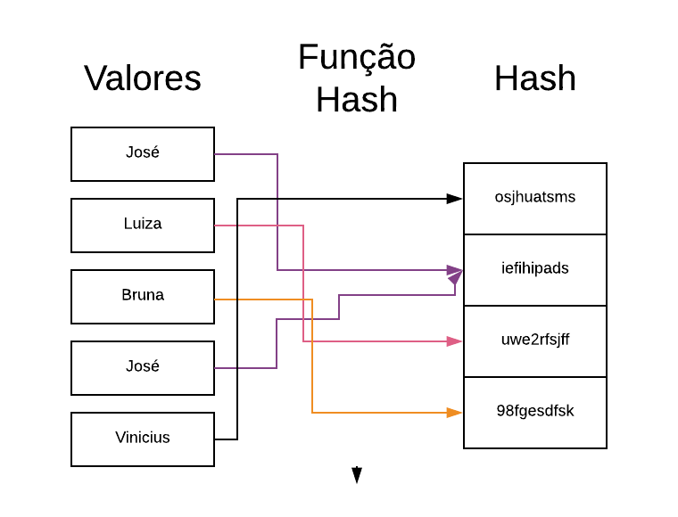
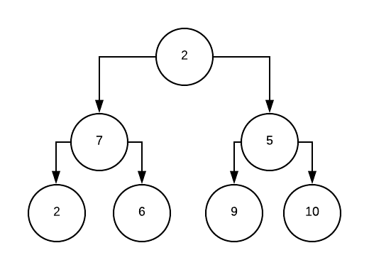

# Função Hash

Uma função hash é qualquer função que possa ser usada para mapear dados de tamanho variáveis em um dado de tamanho fixo. Esses valores retornados podem ser chamados de *hashes.* As funções hash são geralmente usadas em combinação com uma tabela de hash, que é uma estrutura que relaciona os valores com um código é muito usada na criptografia mas pode ser usada para aumentar a velocidade de pesquisas em uma massa de dados.

As funções de hash conseguem acelerar essas pesquisas, por que detectam registros duplicados e os trata como apenas um valor, diminuindo assim o tamanho da massa de dados. No exemplo da figura a baixo, podemos ver uma massa de dados de 5 valores que após passar por uma função de hash, agrupa os valores repetidos e retorna uma massa de apenas 4 registros. Essa redução em uma quantidade mínima de dados como essa, pode não gerar tanta diferença, mas se replicarmos este modelo para uma base com centenas de milhares de registro, a diferença é extremamente significante.

# Árvore Binária

Na computação, uma arvore binária é uma estrutura de dados, formada por nós que tem no máximo dois filhos, que são definidos como *filho esquerdo* e *filho direito.*

Na computação a arvore binária pode ser definida com as seguintes características:

- Uma árvore binária com raiz tem um nó raiz e cada nó tem no máximo dois filhos
- Uma árvore binária completa é uma árvore na qual cada nó possui 0 ou 2 filhos
- Uma árvore binária perfeita é uma árvore binária na qual todos os nós interiores tem dois filhos e todas as folhas têm a mesma *profundidade.* Um exemplo desta situação é o mapa de ancestralidade de uma pessoa para uma dada profundidade, pois cada pessoa tem exatamente dois pais biológicos.
- Em uma árvore binária completa, todos os níveis, exceto possivelmente o último, estão completamente preenchidos, e todos os nós do último nível estão o mais longe possível.
- Toda árvore binária completa pode ser eficientemente representada usando uma matriz
- Uma árvore degenerada é onde cada nó pai possui apenas um nó filho associado

